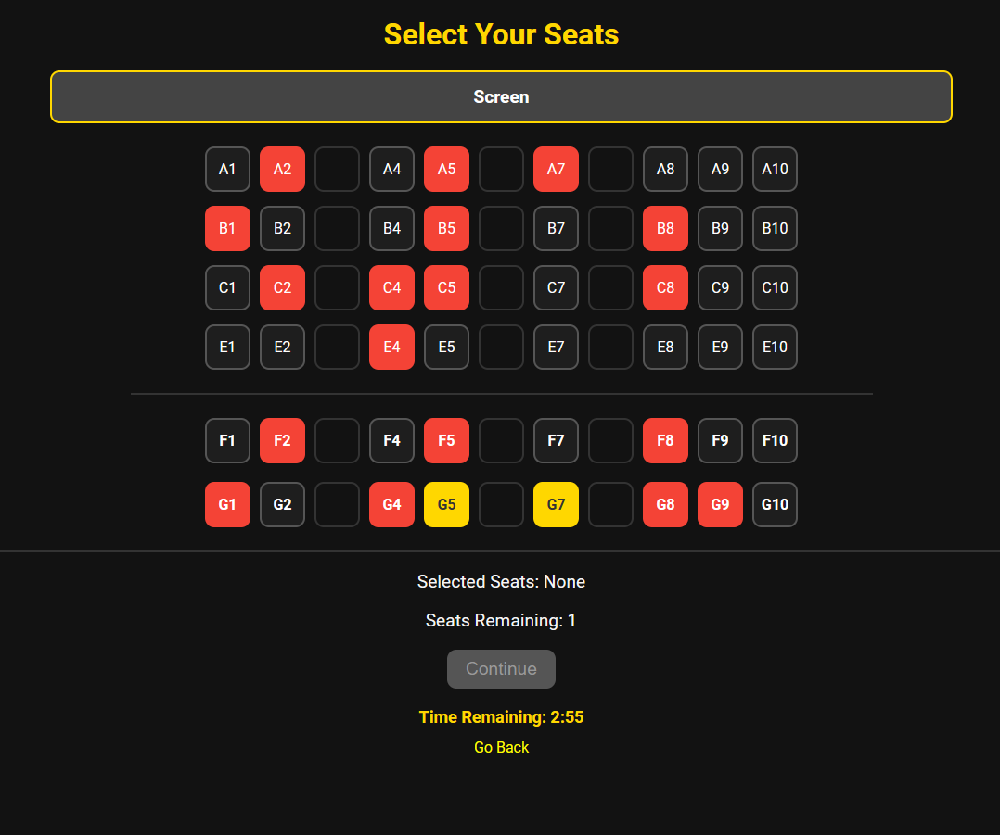
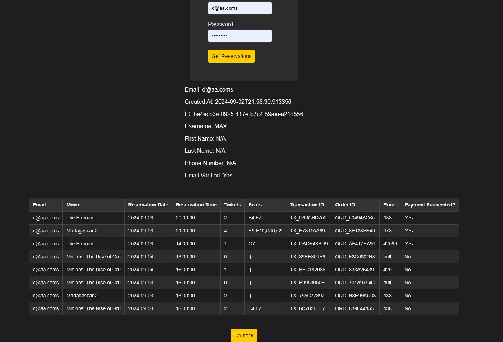
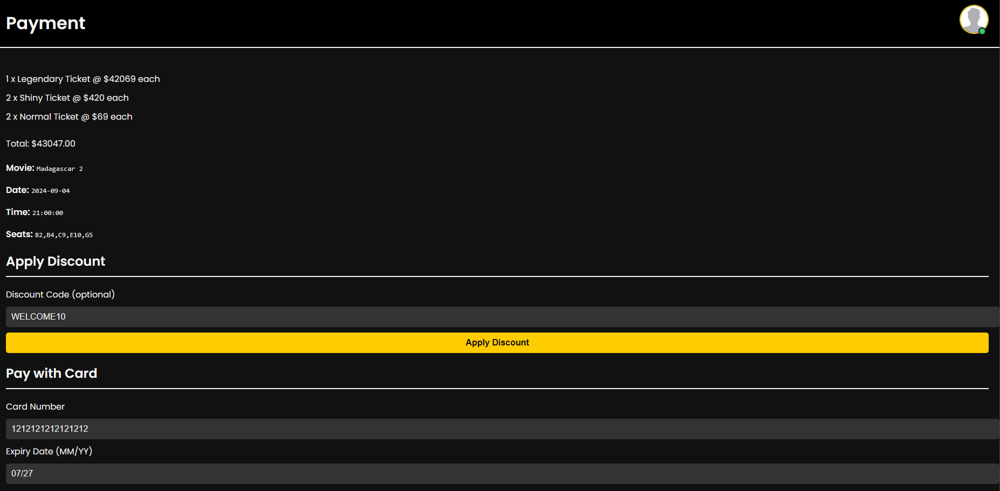
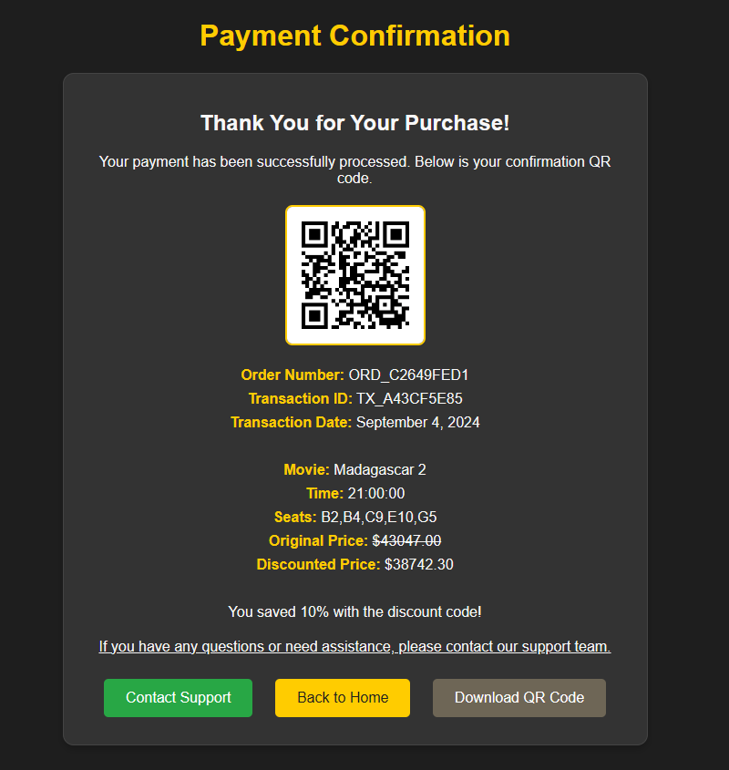

# Cinemax
Cinemax is a modern cinema booking platform that allows users to browse movies, select seats, and book tickets. The project is built using HTML, CSS, and JavaScript, featuring a clean and responsive design. It uses [Cinemax-B](https://github.com/pyoneerC/Cinemax-B) as the backend API to manage user authentication and bookings, written in Python.

[Live Demo](https://cinemaximo.netlify.app/)

Main Page:

Seat Reservation:

Profile Information:

Payment Page:

Receipt Generation:


## Features
- Movie Catalog: Display a list of movies.
- Seat Selection: Choose seats based on availability.
- User Registration & Login: Register and log in to manage bookings.

## Setup
Clone the Repository

```bash
git clone https://github.com/pyoneerC/Cinemax-F.git
cd cinemax
```

Navigate to the project directory and open the index.html file in your web browser:

```bash
open index.html
```
or

```bash
start index.html
```

depending on your operating system.

## Usage
- Browse Movies

Navigate to the home page to view a list of available movies.

- Select Seats

Go to the seat selection page for a movie to choose your seats.

- Register/Login

Use the registration and login forms to create an account or access existing bookings.

## Development

## Running Locally
You can run the project locally without any server setup. Simply open the index.html file in a web browser.

## Testing
For testing purposes, use the browser’s built-in developer tools to check console logs and inspect elements.

## Deployment
To deploy the project, host the files on any static file hosting service such as GitHub Pages, Netlify, or Vercel.

### Contributing
Contributions are welcome! Please follow these steps:

- Fork the repository.
- Create a new branch for your feature or fix.
- Commit your changes.
- Push the branch to your fork.
- Open a pull request.

### License
This project is licensed under the MIT License. See the LICENSE file for details.

Contact
For questions or feedback, contact: maxcomperatore@gmail.com
